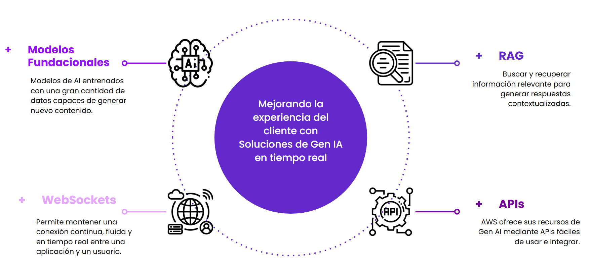
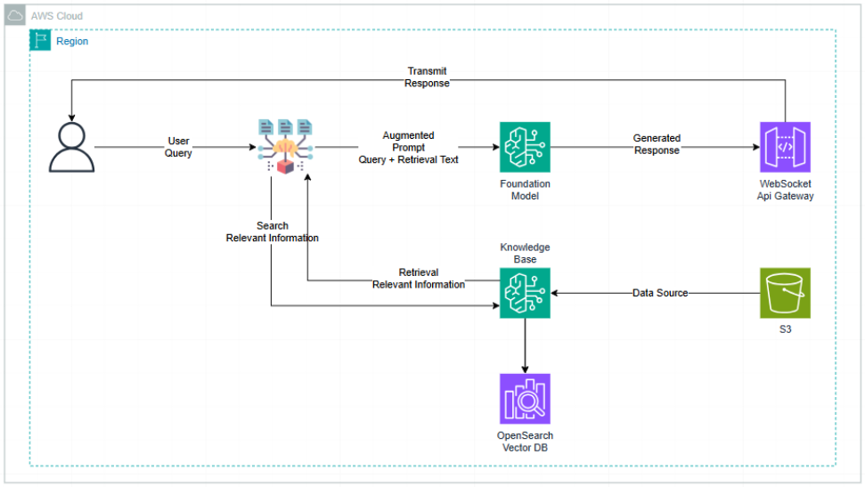
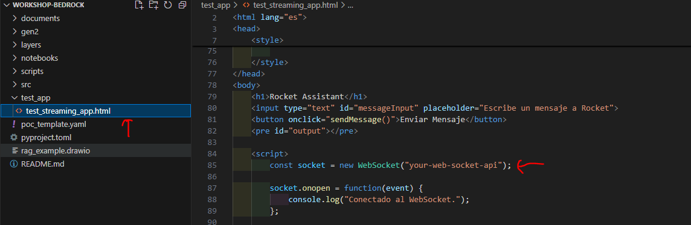
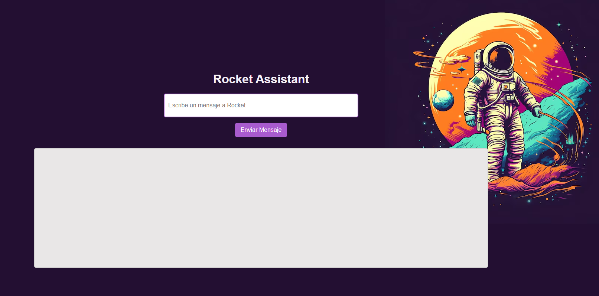

# Workshop Bedrock: Soluciones de Gen IA en tiempo real

Construir una solución en tiempo real que combina Retrieval-Augmented Generation (RAG) con modelos fundacionales de Amazon Bedrock, y cómo exponerla usando API Gateway WebSockets.

## Algunos Conceptos Claves


## Arquitectura RAG



## Estructura del Proyecto

```
└── 📁workshop-bedrock
    └── 📁documents
        └── readme.txt
    └── 📁gen2
    └── 📁imgs
        └── image_app.png
        └── image_config_ws.png
        └── image_key_concepts.png
        └── image_rag_arq.png
    └── 📁layers
        └── workshop-bedrock-layer.zip
    └── 📁notebooks
        └── 01-test-bedrock-api.ipynb
    └── 📁scripts
        └── commands_s3.sh
        └── commands_template.sh
    └── 📁src
        └── 📁app_connect
            └── app_connect.py
        └── 📁app_disconnect
            └── app_disconnect.py
        └── 📁app_inference
            └── app_inference.py
            └── config_fm.py
            └── config_kb.py
            └── gen_ai_service.py
    └── 📁test_app
        └── test_streaming_app.html
    └── poc_template.yaml
    └── pyproject.toml
    └── README.md
```

## Prerrequisitos

- Tener una cuenta de AWS.
- Tener instalado y configurado [AWS CLI](https://aws.amazon.com/cli/).
- Tener configurado un perfil de AWS (opcional pero recomendado). Si no lo tienes, puedes configurarlo usando `aws configure`.

## Pasos de Ejecución

### 1. Crear un Bucket de S3 para Almacenar Documentos

Este paso es necesario para almacenar los documentos que nutrirán tu base de conocimiento.

#### 1.1 Crear el Bucket

Usa el siguiente comando para crear el bucket:

```bash
aws s3 mb s3://your-bucket-name --profile your-profile
```

#### 1.2 Validar la Creación del Bucket

Para confirmar que el bucket se ha creado correctamente, ejecuta:

```bash
aws s3 ls --profile your-profile
```

#### 1.3 Cargar Documentos al Bucket

Los documentos que se encuentren en la carpeta `documents` serán los que cargarás en el bucket.

Para cargar documentos:

- Cargar un solo archivo:

```bash
aws s3 cp your-file.ext s3://<your-bucket-name>/path/ --profile your-profile
```

- Cargar todos los archivos en un directorio:

```bash
aws s3 cp your-path-file s3://<your-bucket-name>/path/ --recursive --profile your-profile
```

#### 1.4 Validar los Documentos Cargados

Para verificar que los documentos se han cargado correctamente, usa:

```bash
aws s3 ls s3://<your-bucket-name>/path/ --profile your-profile
```

### 2. Crear la Base de Conocimiento en Bedrock Usando la Consola de AWS

Sigue los pasos a continuación para crear una base de conocimiento en la consola de AWS:

1. **Accede a la consola de AWS** en tu navegador.
2. Navega al servicio **Bedrock**.
3. En la sección de **Builder tools**, selecciona **Knowledge Base**.
4. Haz clic en **Create** y selecciona **Knowledge Base with vector store**.
5. Asigna un nombre a tu base de conocimiento en el campo correspondiente.
6. En la sección **IAM Permissions**, selecciona **Create and use a new service role**, y luego haz clic en **Next**.
7. En el apartado **Choose data source**, selecciona **S3** como fuente de datos.
8. Haz clic en **Browse** para buscar la ruta en S3 donde están almacenados tus documentos, y luego selecciona **Choose**. Después, haz clic en **Next**.
9. Elige un **Embeddings model**. Selecciona **Titan Text Embeddings v2** (es una de las opciones disponibles).
10. Mantén la configuración predeterminada para la **Vector database** y haz clic en **Next**.
11. Revisa todos los detalles en la sección **Review and create** y, si todo está correcto, haz clic en **Create Knowledge Base**.

Este proceso tomará algunos minutos. Mientras tanto, puedes continuar configurando el resto de la infraestructura.

### 3. Configurar los Parámetros en la Plantilla de AWS SAM

Con la base de conocimiento creada, actualiza los siguientes parámetros en la plantilla de AWS SAM (template.yaml):

- stage: El entorno en el que se desplegará (ejemplo: dev, prod).
- projectName: El nombre de tu proyecto.
- ProjectPrefix: Prefijo que usarás para los recursos creados.
- knowledgeBaseId: El ID de la base de conocimiento que obtuviste en el paso 2.
- layerSelected: El ARN de la capa que creaste (para usar una capa como loguru).

### 4. Desplegar Recursos Usando IaC

#### 4.1 Crear un Bucket de S3 para el Template de SAM

Necesitarás otro bucket para alojar el template de SAM y permitir su despliegue:

```bash
aws s3 mb s3://your-bucket-name --profile your-profile
```

#### 4.2 Validar que el Bucket se haya creado Exitosamente

```bash
aws s3 ls --profile your-profile
```

#### 4.3 Crear la Capa (Opcional)

Si vas a crear una capa, puedes hacerlo con el siguiente comando:

```bash
aws lambda publish-layer-version --layer-name your-layer-name --zip-file layers/your-layer-file.zip --profile your-profile
```

#### 4.4 Validar la Creación de la Capa

Verifica que la capa se haya creado y obtén su ARN:

```bash
aws lambda list-layer-versions --layer-name your-layer-name --profile your-profile
```

#### 4.5 Empaquetar el Template de SAM

Usa el siguiente comando para empaquetar el template y subirlo al bucket de S3:

```bash
aws cloudformation package --s3-bucket your-bucket-name --template-file poc_template.yaml --output-template-file gen2/template-generated.yaml --profile your-profile
```

#### 4.6 Desplegar el Template

Despliega el template empaquetado a AWS con:

```bash
aws cloudformation deploy --template-file gen2/template-generated.yaml --stack-name your-stack-name --capabilities CAPABILITY_IAM --profile your-profile
```

### 5. Validar Recursos Desplegados

Para asegurarte de que los recursos fueron desplegados correctamente, puedes ir a la consola de CloudFormation y revisar si el stack fue creado exitosamente.

- Path: CloudFormation -> Stacks -> Selecciona Tu Stack -> Stack Info (Status esperado: **CREATE_COMPLETE**)

### 6. Probar tu App

#### 6.1 Configuración del WebSocket

Dentro de la carpeta test_app, encontrarás un archivo llamado test_streaming_app.html. Ábrelo y ajusta el valor de "your-web-socket-api" al endpoint de tu WebSocket generado. Este endpoint lo encontrarás en los outputs de tu stack en CloudFormation.



#### 6.2 Probar la Aplicación - Let's go rock out🎸🔥!

Finalmente, abre el archivo **test_app/test_streaming_app.html** en tu navegador y prueba la aplicación.

Path: Clic Derecho sobre el archivo -> Abrir Con -> Elige Tu Navegador



